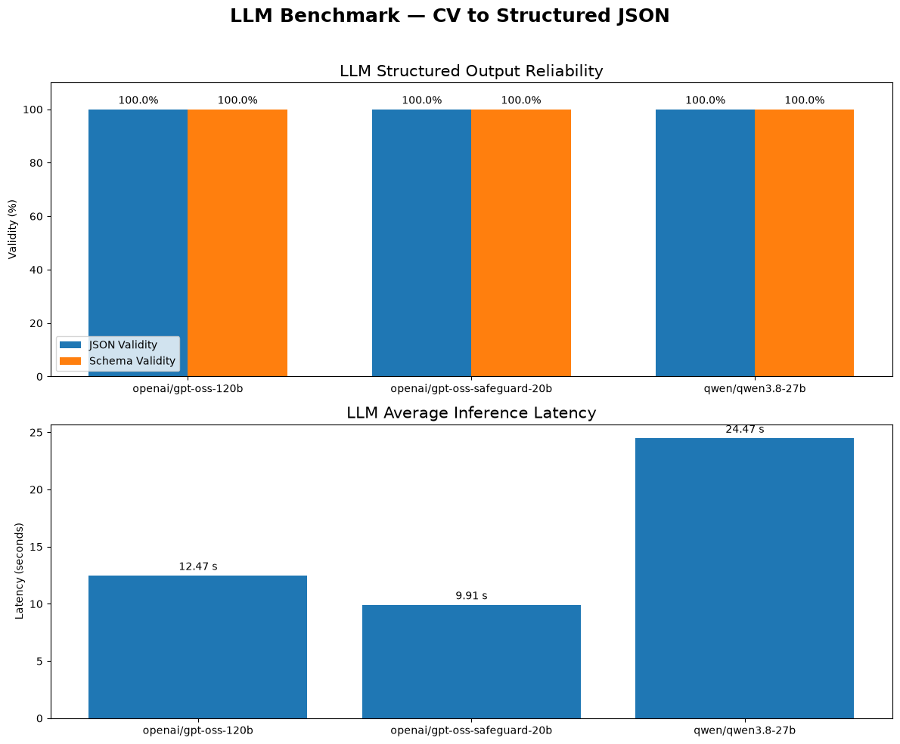

# CV2Portfolio 🚀

**CV2Portfolio** is an AI-powered application that automatically transforms a CV into a structured portfolio.

The project uses **Large Language Models (LLMs)** to extract, structure, and validate information from a CV, then generates a portfolio-ready JSON representation that can be used to build a personal portfolio website.

---

## 🎥 Demo

A complete demonstration of **CV2Portfolio** is available on YouTube:

▶️ **[Watch the CV2Portfolio Demo](https://www.youtube.com/watch?v=FGlM8nCcXwQ)**

The demo shows the complete workflow, from **CV upload and information extraction to structured JSON generation and portfolio rendering**.

---

## ✨ Features

* 📄 Upload a CV in PDF format
* 🔍 Automatic CV text extraction
* 🤖 LLM-based information extraction
* 🧩 Conversion from unstructured CV text to structured JSON
* ✅ JSON format validation
* 🔐 Schema validation
* 🌐 Support for LinkedIn, GitHub and personal website links
* 🎨 Portfolio generation from structured data
* 📊 LLM model benchmarking
* ⚡ FastAPI backend

---

## 🏗️ Architecture

```text
                     ┌─────────────────┐
                     │     CV Upload   │
                     │      (PDF)      │
                     └────────┬────────┘
                              │
                              ▼
                    ┌──────────────────┐
                    │   PDF Extraction │
                    │    PyMuPDF       │
                    └────────┬─────────┘
                             │
                             ▼
                    ┌──────────────────┐
                    │   Parser Agent   │
                    │      LLM         │
                    └────────┬─────────┘
                             │
                             ▼
                    ┌──────────────────┐
                    │  JSON Validation│
                    │      + Schema    │
                    └────────┬─────────┘
                             │
                             ▼
                    ┌──────────────────┐
                    │ Portfolio JSON   │
                    └────────┬─────────┘
                             │
                             ▼
                    ┌──────────────────┐
                    │    Portfolio     │
                    │    Rendering     │
                    └──────────────────┘
```

---

## 🧠 Portfolio Data Schema

The extracted information is structured into a standardized JSON format:

```json
{
  "name": "...",
  "title": "...",
  "summary": "...",
  "skills": [],
  "education": [],
  "experience": [],
  "projects": [],
  "languages": []
}
```

This structure makes the extracted CV information reusable for different portfolio templates and applications.

---

## 📊 Model Benchmark

A benchmark was conducted to evaluate the reliability and latency of different LLMs for CV-to-JSON extraction.

### Evaluation Metrics

* **JSON Valid Rate** — Percentage of generated outputs containing valid JSON.
* **Schema Valid Rate** — Percentage of outputs conforming to the expected portfolio schema.
* **Average Latency** — Average processing time per CV, measured in seconds.
* **Tests** — Number of evaluated CV test cases.

### Results

| Model                          | JSON Valid Rate | Schema Valid Rate | Average Latency (s) | Tests |
| ------------------------------ | --------------: | ----------------: | ------------------: | ----: |
| `openai/gpt-oss-120b`          |          100.0% |            100.0% |               12.47 |    20 |
| `openai/gpt-oss-safeguard-20b` |          100.0% |            100.0% |            **9.91** |    20 |
| `qwen/qwen3.8-27b`             |          100.0% |            100.0% |               24.47 |    19 |

### Benchmark Summary

All evaluated models achieved:

* **100% JSON validity**
* **100% schema validity**

The measured average latency ranged from **9.91s to 24.47s per CV** under the experimental setup.

`openai/gpt-oss-safeguard-20b` recorded the lowest average latency among the evaluated models.

> **Note:** Benchmark results depend on the model version, API provider, prompt, network conditions, infrastructure, and test dataset. These results represent measurements from this specific experimental setup and should not be interpreted as universal model performance.

---

## 🛠️ Tech Stack

### Backend

* Python
* FastAPI
* PyMuPDF
* Pydantic
* LLM APIs

### AI / NLP

* Large Language Models (LLMs)
* Prompt Engineering
* Structured JSON Generation
* Schema Validation

### Frontend

* HTML
* CSS
* JavaScript

---

## 📁 Project Structure

```text
CV2Portfolio/
│
├── Template/
│   └── Abdessamad AMTOUG — Ajouter CV & liens.html
│
├── agent/
│   └── agent_parser.py
│
├── main.py
│
├── requirements.txt
│
├── benchmark/
│   └── ...
│
├── README.md
│
└── ...
```

---

## ⚙️ Installation

### 1. Clone the repository

```bash
git clone https://github.com/amtoug/CV2Portfolio.git
cd CV2Portfolio
```

### 2. Create a virtual environment

```bash
python -m venv venv
```

### 3. Activate the virtual environment

#### Windows

```bash
venv\Scripts\activate
```

#### Linux / macOS

```bash
source venv/bin/activate
```

### 4. Install dependencies

```bash
pip install -r requirements.txt
```

---

## 🔑 Environment Variables

Create a `.env` file and add the required API configuration:

```env
Groqkey=your_api_key
```

Depending on the configured LLM provider, additional environment variables may be required.

---

## ▶️ Running the Application

Start the FastAPI server:

```bash
uvicorn main:app --reload
```

The API will be available at:

```text
http://127.0.0.1:8000
```

FastAPI interactive documentation:

```text
http://127.0.0.1:8000/docs
```

---

## 🔄 Workflow

The application follows the following workflow:

```text
CV
 │
 ▼
PDF Text Extraction
 │
 ▼
LLM Parser
 │
 ▼
Structured JSON
 │
 ▼
JSON Validation
 │
 ▼
Schema Validation
 │
 ▼
Portfolio Data
 │
 ▼
Portfolio Rendering
```

---

## 📥 API Usage

The `/upload` endpoint accepts a CV and optional professional links.

Example request:

```text
POST /upload
```

Parameters:

```text
cv       → CV file
linkedin → LinkedIn profile URL
github   → GitHub profile URL
website  → Personal website URL
```

The API processes the CV and returns structured portfolio information.

---

## 🎯 Use Cases

CV2Portfolio can be used to:

* Automatically create a personal portfolio from a CV
* Convert unstructured professional information into structured data
* Build AI-assisted portfolio generators
* Experiment with LLM structured outputs
* Benchmark LLMs for information extraction
* Reduce manual data entry when creating professional portfolios

---

## 👨‍💻 Author

**Abdessamad AMTOUG**

AI / Data Engineer

GitHub: `https://github.com/amtoug`

---

## 📄 License

This project is intended for educational and experimental purposes.
